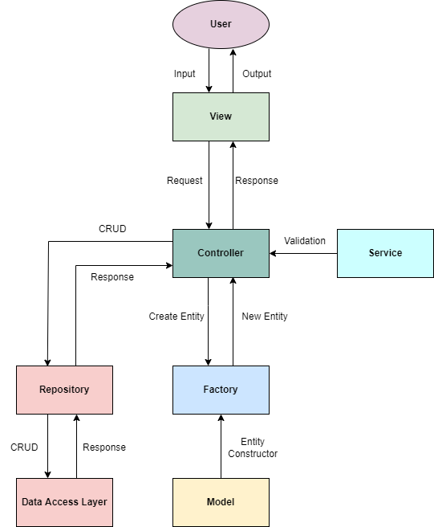

# School management

This repository contains my solution of the assignment "Individual Project Part B", for the [Peoplecert Coding Bootcamp](https://peoplecerteducation.org/bootcamp/) (CB16). This solution was submitted on the 8th of June, 2022 and demonstrates my  level of C# three months into the bootcamp.

The project is a console application, in which a school administrator can make CRUD operations against a database for all the school entities and extract useful information. The entities of interest are:

- Course
- Trainer
- Student
- Assignment

Each course can have multiple trainers, students, and assignments. Trainers and students can teach and attend multiple courses respectively. Also, a student can have the same assignment in different courses.

## Technical information

The application was built using .NET Framework 4.7.2 on Microsoft Visual Studio Community 2022.

1. [Database](#database)
2. [Architecture](#architecture)
3. [How to run](#how-to-run)

### Database

The main goal of this project was to connect to a relational database using ADO.NET and execute relevant queries. The project was developed with a database-first approach, in order to accustom myself with relational databases and SQL Server.

The schema of my database is shown below:

Aside from ADO.Net, I also used Dapper for the *Course* entity, which had the most challenging queries. It is apparent that by using Dapper the development is smoother and a lot of time can be saved.

----------

### Architecture

My implementation is based on the following schematic:

The user interacts with the View classes and provides the necessary input. The input is then passed from the Views to the Controllers, which responds with the appropriate response.

The Controllers can validate user input and access the database layer through the Repositories. For the Repositories, a Generic Repository design pattern has been implemented, avoiding code replication (DRY).

Additionally, an attempt has been made to implement the Dependency Inversion (DI) design principle, according to which the higher lever modules depend on abstractions, rather than other lower lever modules.
For this reason, the ApplicationFactory class was created, which initializes all the application components based on their abstractions. As a result, the individual components of the applications can be replaced with others that satisfy the necessary interfaces. An example that this works as intended, is the interchangable use of ADO.NET and Dapper on the Data Access Layer, by replacing the corresponding constructor in the ApplicationFactory with the other's.

----------

### How to run

You can run the application on your machine, following these steps:

1. Install the database

   A backup of the database is included in the folder *"Database"*, along with the corresponding script that creates the database and populates the data. Either restore the database or run the query to create the database on the local SQL Server.

2. Replace the connection string for your SQL Server.

   The connection string is included in the *app.config* file and the application reads it directly from there. As a result, you must open the *app.config* and replace the Server name in the connection string with your Server name.

*Please note that the app is built using .NET Framework, so you can only run it on Windows machines.*
